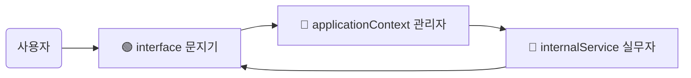

# Rodi X 핵심 모듈 가이드 (초보자용)

## 👋 시작하며
이 문서는 **Rodi X**라는 소프트웨어가 어떻게 작동하는지 궁금해하는 분들을 위해 작성되었습니다. 복잡한 코드 이야기보다는, **Rodi X가 어떻게 생겼고 각 부품들이 무슨 일을 하는지** 쉽게 설명해 드릴게요.

우리가 분석할 3가지 핵심 모듈은 다음과 같습니다.
1.  **applicationContext**: 몸체의 **"뇌"** (전체 관리)
2.  **interface**: 몸체의 **"신경계"** (신호 전달)
3.  **internalService**: 몸체의 **"장기"** (실질적인 기능 수행)

---

## 🗺️ 전체 그림 (Big Picture)

먼저 그림으로 전체적인 관계를 살펴볼까요?

## 🗺️ 전체 흐름도 (한눈에 보기)

복잡한 그림 대신, 데이터가 흘러가는 순서를 간단하게 정리했습니다.

### 데이터가 이동하는 길
1.  **사용자 (요청)** ➡️ **interface (접수)**
2.  **interface** ➡️ **applicationContext (관리자 승인)**
3.  **applicationContext** ➡️ **internalService (실무 처리)**
4.  **internalService** ➡️ **interface (결과 보고)**
5.  **interface** ➡️ **사용자 (완료)**

### 구조도


---

## 1. 🔴 applicationContext: "뇌" (전체 관리자)

**위치:** `rodi-x-svc/modules/applicationContext`

가장 먼저 알아볼 것은 `applicationContext`입니다. 이 친구는 Rodi X의 **관리자**이자 **뇌**입니다.

### 무슨 일을 하나요?
*   **조립 반장:** 프로그램이 시작될 때 필요한 부품(플러그인, 서비스)들을 모두 찾아서 제 자리에 끼워 맞춥니다.
*   **도구 상자:** 다른 부품들이 필요로 하는 도구(파일 저장소, 유틸리티 등)를 챙겨 뒀다가 빌려줍니다.
*   **시작 버튼:** 준비가 다 되면 모든 부품들에게 "자, 이제 일을 시작하세요!"라고 명령을 내립니다.

> **쉽게 생각하기:**  
> 건물을 지을 때, 자재를 주문하고 작업자들을 배치하고 공사를 시작시키는 **현장 소장님**이라고 보시면 됩니다.

---

## 2. 🟢 interface: "신경계" (소통 창구)

**위치:** `rodi-x-svc/modules/interface`

`interface`는 외부(사용자나 다른 프로그램)에서 들어오는 요청을 받아서 내부로 전달하는 **창구** 역할을 합니다.

### 무슨 일을 하나요?
*   **듣는 귀 (`sdkService`):** "프로그램을 열어줘", "저장을 해줘" 같은 요청(이벤트)이 들어오는지 항상 귀를 기울이고 있습니다.
*   **전달자 (`sdkCommand`):** 요청을 들으면, 그 일을 실제로 처리할 수 있는 담당자(`internalService`)에게 일을 토스합니다.

> **쉽게 생각하기:**  
> 식당의 **웨이터**입니다. 손님(사용자)이 주문(요청)을 하면, 주방(내부 서비스)에 "김치찌개 하나요!"라고 외쳐주는 역할이죠.

---

## 3. 🔵 internalService: "장기" (실제 일꾼)

**위치:** `rodi-x-svc/modules/internalService`

마지막으로 `internalService`는 실제로 땀 흘려 일하는 **일꾼**들입니다. 관리자(`applicationContext`)가 고용하고, 웨이터(`interface`)가 가져온 주문을 처리합니다.

### 어떤 일꾼들이 있나요?

1.  **Daemon (데몬 팀):**
    *   보이지 않는 곳에서 계속 돌아가는 서비스들입니다. (예: 백그라운드 통신)
2.  **Interop (정보 제공 팀):**
    *   외부에서 "지금 설치된 프로그램 목록 좀 줘"라고 하면 데이터를 예쁘게 포장해서 내줍니다.
3.  **Page (화면 관리 팀):**
    *   사용자가 보는 화면(페이지)을 띄우거나 닫고, 화면에 글자를 쓰는 일을 담당합니다.
    *   만약 실수를 했다면 되돌리기(Undo/Redo) 기능도 이 팀에서 관리합니다.

> **쉽게 생각하기:**  
> 식당의 **주방 요리사**들 👨‍🍳 입니다. 주문 들어온 요리를 실제로 만들고, 그릇에 담아내는 핵심적인 일을 합니다.

---

## 🎬 시나리오: "페이지를 열어줘!"

사용자가 버튼을 클릭해서 **"새로운 페이지를 열어줘"** 라고 했을 때, Rodi X 내부에서는 어떤 일이 벌어질까요?

1.  **사용자:** 버튼 클릭! (이벤트 발생: `rodix_open_page`)
2.  **웨이터 (interface):** "어? 페이지 열어달라는 주문이 들어왔네?" (`sdkService`가 감지)
3.  **웨이터 (interface):** "주방장님! 페이지 하나 열어주세요!" (`sdkCommand`가 호출)
4.  **주방장 (internalService - Page팀):** "알겠습니다. 이 페이지 담당자를 찾아서 화면을 띄울게요." (`pageDispatcher`가 처리)
5.  **관리자 (applicationContext):** (이 모든 과정이 잘 돌아가도록 미리 세팅해 둠)
6.  **결과:** 사용자 눈앞에 짠! 하고 페이지가 나타납니다.

---

## ✅ 요약

이 3가지 모듈은 한 몸처럼 움직입니다.

*   🔴 **applicationContext**가 판을 깔아주고,
*   🟢 **interface**가 외부 요청을 받아오면,
*   🔵 **internalService**가 실제로 일을 처리합니다.

---

## 💻 코드 뜯어보기 (한 줄 요약 포함)

실제 코드가 어떻게 생겼는지, 중요한 부분만 쏙 뽑아서 설명해 드릴게요.

### 1. 🔴 applicationContext (뇌) - `initialize` 함수

이 함수는 **관리자(applicationContext)**가 업무를 시작할 때 부르는 함수입니다. 준비물을 챙기고 나서 "작업 시작!"을 외치는 과정이죠.

```javascript
// applicationContext/index.js

function initialize() {
    if(IsConfigured === false) { // 1. 이미 준비된 상태가 아니라면 (처음 실행이라면)
        IsConfigured = true;     // 2. "이제 준비 중입니다"라고 깃발을 꽂습니다.

        initializeContainer();   // 3. 도구 상자(컨테이너)를 정리합니다. (필요한 도구 세팅)
        cleanupAssemblies();     // 4. 예전에 쓰다 남은 더러운 자재들을 청소합니다.
        extractAsarAssemblies(); // 5. 압축된 자재 박스(ASAR 파일)를 풉니다.
        loadAssemblies();        // 6. 자재(플러그인)를 작업장으로 가져옵니다.
        loadDebugAssemblies();   // 7. (테스트용) 자재도 가져옵니다.

        startActivator();        // 8. "자, 각자 맡은 일을 시작하세요!" (서비스 실행)
    }
}
```

### 2. 🟢 interface (신경계) - `runServices` 함수

이 함수는 **웨이터(interface)**가 손님의 주문을 받을 준비를 하는 과정입니다. "이런 주문이 들어오면 주방에 알려줘야지" 하고 메모해 두는 것과 같습니다.

```javascript
// interface/sdkService.js

function runServices() {
    // 1. 'rodix_initialize'라는 주문(이벤트)이 오면 subscribeEvent 함수를 실행해! 라고 등록합니다.
    self.$eventManager.subscribe('rodix_initialize', subscribeEvent);
    
    // 2. 'rodix_open_page' (페이지 열기) 주문이 오면 주방에 알릴 준비를 합니다.
    self.$eventManager.subscribe('rodix_open_page', subscribeEvent);
    
    // ... (다른 주문들도 다 똑같이 등록합니다)
    self.$eventManager.subscribe('rodix_close_page', subscribeEvent);
}

// 주문이 들어오면 실제로 하는 일
function subscribeEvent(event, data, callback) {
    // sdkCommand(주방 주문서)에 있는 해당 이벤트 함수를 찾아서 실행합니다.
    sdkCommand[event](data.data, callback); 
}
```

### 3. 🔵 internalService (장기) - `openPage` 함수

이 함수는 **주방 요리사(internalService)**가 "페이지 열기"라는 주문을 받고 실제로 요리(화면 띄우기)를 하는 과정입니다.

```javascript
// internalService/page/pageDispatcher.js

let openPage = function(key){ // key: 어떤 페이지를 열지 알려주는 표딱지
    
    // 1. 창고(PresentationCore)에서 해당 페이지 정보를 가져옵니다.
    let composite = applicationContext.getPresentationCore().get(key);
    
    // 2. 만약 창고에 그런 페이지가 없으면? "그런 거 없는데요!" 하고 에러를 냅니다.
    if(composite === null) {
        throw new Exception.XPluginException(...) 
    }

    let contribution = composite.contribution; // 페이지의 실제 담당자

    try {
        // 3. 담당자에게 "화면 보여주세요(openView)"라고 시킵니다.
        utils.invoke(contribution, contribution.openView);
    } catch(e) {
        // 4. 실패하면 "못 열겠어요" 하고 기록(로그)을 남기고 에러를 던집니다.
        $logger.error(key, ' - ', e.message);
        throw new Exception.XPluginException(...)
    }

    // 5. 페이지 상태를 "활성화됨(Active)"으로 바꿉니다. 이제 사용자 눈에 보입니다!
    pageHandler.setActive(true); 

    // 6. 성공적으로 열었다고 보고서를 리턴합니다.
    return pageInfo;
};
```

이 문서가 Rodi X의 작동 원리를 이해하는 데 도움이 되기를 바랍니다!

